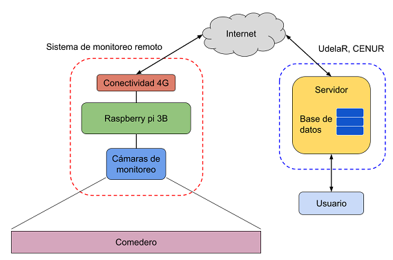

# CiberKillChain - Ataque
## Alumno
Denis J. Genero
## Objetivos
- Sabotear el sistema para entorpecer su funcionamiento y favorecer el desarrollo de la competencia.

## Sistema victima
El sistema está compuesto por un servidor central ubicado en el CENUR Litoral Norte de la Universidad de la República (UdelaR) en la ciudad de Paysandú, Uruguay. Este servidor se encuentra conectado a una Raspberry Pi 3B, la cual es responsable de capturar y procesar imágenes provenientes de cámaras IP instaladas en un rodeo lechero. El objetivo principal de este sistema es analizar dichas imágenes para estimar el consumo de alimento del ganado. La arquitectura general del sistema se representa en la siguiente figura:

## Resolución
A continuación se describen los pasos del ataque.

### 1- Reconnaissance
- [Gather Victim Network Information](https://attack.mitre.org/techniques/T1592/): Decido recorrer las instalaciones del CENUR Litoral Norte con el objetivo de familiarizarme con el entorno y analizar posibles ubicaciones donde podría encontrarse el servidor central. Observo la infraestructura de la red, identifico posibles puntos de acceso y evalúo las medidas de seguridad implementadas.
- [Gather Victim Org. Information](https://attack.mitre.org/techniques/T1591/): Puedo acercarme al área de informática y, sin llamar la atención, simulo estar distraído o realizando otra actividad mientras presto atención a conversaciones del personal. El objetivo es recopilar información relevante, como menciones sobre problemas técnicos, cambios en la infraestructura de red o posibles vulnerabilidades en el sistema.
- [Trusted Relationship](https://attack.mitre.org/techniques/T1199/): Puedo establecer una relación de confianza con algún miembro del área de informática, mostrándome como alguien amigable y confiable. A través de interacciones casuales o colaboraciones, intento obtener información clave, como detalles sobre la configuración del sistema, acceso a credenciales o pistas sobre los protocolos de seguridad utilizados en la institución.

### 2- Weaponization
- [Obtain Capabilities](https://attack.mitre.org/techniques/T1588/): Decido descargar un software malicioso diseñado para generar una sobrecarga en el servidor, afectando su rendimiento y estabilidad. Analizo diferentes herramientas disponibles en línea para seleccionar la más adecuada según el tipo de infraestructura y los protocolos de seguridad implementados en la red.
- [Stage Capabilities](https://attack.mitre.org/techniques/T1608/): Decido utilizar una Raspberry Pi, instalarle el software descargado para infectar el servidor y la configuro para operar de forma autónoma dentro de la red. Esto reduce el riesgo de ser detectado y permite ejecutar el ataque de manera remota o programada.
- [Develop Capabilities](https://attack.mitre.org/techniques/T1587/): Puedo desarrollar una aplicación maliciosa con el objetivo de saturar el servidor. Esto me permite personalizar su comportamiento, adaptar los métodos de ataque y evitar posibles detecciones por parte de los sistemas de seguridad de la institución.
- [Compromise Infraestructure](https://attack.mitre.org/techniques/T1584/): Puedo alterar la configuración de la infraestructura de red para facilitar el acceso al sistema. Esto puede incluir liberar un puerto bloqueado, modificar reglas de firewall o redirigir tráfico a través de un servidor intermediario, permitiendo un control remoto sobre la red comprometida.

### 3- Delivery
- [Adquire access:](https://attack.mitre.org/techniques/T1650/) Decido hacerme pasar por estudiante para ingresar a la institución sin llamar la atención y llevo la Raspberry Pi oculta en una mochila, asegurándome de que el dispositivo esté preparado para su posterior activación y despliegue.
- [Hardware Additions](https://attack.mitre.org/techniques/T1200/): Decido buscar un lugar discreto dentro del establecimiento para colocar la Raspberry Pi, asegurándome de que pase desapercibida y pueda operar sin interrupciones. Opto por ubicaciones estratégicas, como detrás de muebles, dentro de cajas de conexiones o en áreas poco transitadas.
- Decido conectarla directamente a la red eléctrica del edificio utilizando un adaptador de corriente, asegurando una operación prolongada sin interrupciones.
- [Masquerading](https://attack.mitre.org/techniques/T1036/): Puedo camuflar la Raspberry Pi como un dispositivo legítimo, ya sea dentro de una carcasa similar a la de un equipo de red, disfrazándola como un cargador o un periférico aparentemente inofensivo.
- Como alternativa, puedo utilizar baterías recargables para alimentar la Raspberry Pi, permitiéndole operar de manera autónoma y sin depender de una fuente de energía fija, lo que facilita su instalación en lugares donde no haya acceso a enchufes.

### 4- Exploitation
- [Hide Artifacts](https://attack.mitre.org/techniques/T1564/): La Raspberry Pi queda oculta en el lugar seleccionado, logrando pasar desapercibida sin levantar sospechas ni alertar al personal de la institución.

### 5-Installation
- [Command and Scripting Interpreter](https://attack.mitre.org/techniques/T1059/): Una vez encendida, la Raspberry Pi queda disponible para ejecutar comandos y scripts que permitan interactuar con la red.
- [Valid Accounts](https://attack.mitre.org/techniques/T1078/): La Raspberry Pi se conecta a la red de la institución utilizando credenciales válidas, lo que le permite acceder a los recursos disponibles sin levantar sospechas.

### 6- Command & Control
- [External Remote Services](https://attack.mitre.org/techniques/T1133/): Tengo la capacidad de acceder remotamente a la Raspberry Pi, lo que me permite controlar el dispositivo y manipular sus funciones sin necesidad de estar físicamente presente.
- [Network Sniffing](https://attack.mitre.org/techniques/T1040/): Monitoreo la red de la institución para identificar los momentos de mayor actividad u horas pico, lo que me permite planificar mis acciones de forma estratégica y minimizar la posibilidad de detección.

### 7- Actions on Objectives
- [Remote Service Session Hijacking](https://attack.mitre.org/techniques/T1563/): La Raspberry Pi ejecuta el software, satura al servidor y se provocan caídas en momentos clave, afectando su estabilidad y disponibilidad. Estas interrupciones pueden generar una sensación de inseguridad y disfuncionalidad en el sistema.
- Como resultado, el sistema no funciona adecuadamente y los clientes experimentan problemas recurrentes, lo que provoca su insatisfacción y genera una oportunidad para la competencia de captar a esos clientes.